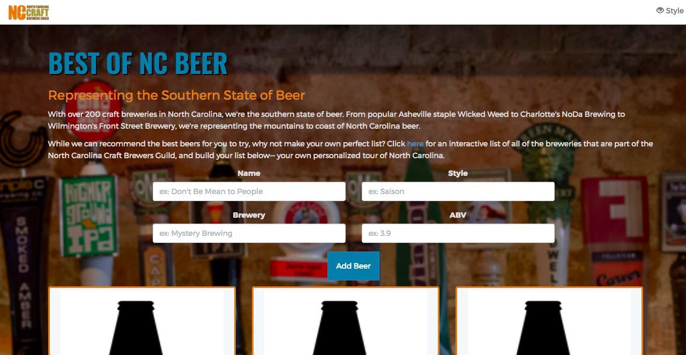

# Best of NC Beer Tracker

With over 200 craft breweries in North Carolina, we're the southern state of beer. From popular Asheville staple Wicked Weed to Charlotte's NoDa Brewing to Wilmington's Front Street Brewery, the North Carolina Craft Brewers Guid is representing the mountains to coast of North Carolina beer.

With so many excellent brews to choose from, why not create your own tour of North Carolina?

This API was built with Laravel framework, and uses the REST method — which allows you to create, post, put \(aka update\), and destroy entries from a data table via AJAX requests. The entries will be formatted as JSON data. While it may sound brew-tally awful to implement, it's anything but.

REST functions:

* Create: adds a new beer to your php data table.
* Post: allows the user to view a beer \(or all beers, depending on the request\) in their data table.
* Put: allows the user to edit a beer in their data table.
* Destroy: deletes a beer in the data table.

And while it's essential to the best of the beer nerds to track their progress, it's important to remember not to stress out about this. There's hop\(e\) for you yet. This is ale in good fun. Cheers!

#### How to run on your machine:

* Download this repository
* Download [Composer](https://getcomposer.org/doc/00-intro.md), a tool for dependency management
* * This is how Laravel will be installed on your machine
* Run MAMP application \(download [here](https://www.mamp.info/en/downloads/) if needed\)
  * In Preferences -&gt; Ports, set Apache port to 8888, Nyginx port to 8888, and MySQL port to 8889
  * In Web Server, set document root to the public folder of the repository
* Create a database named "app" in phpMyAdmin
* Run Laravel command: php artisan migrate
  * This will create database migrations for the tables
* Open [http://localhost:8888/](http://localhost:8888/) in your web browser!

#### Link to my Gitbook:

[https://sarahvassello.gitbooks.io/best-ncbeer-app/](https://sarahvassello.gitbooks.io/best-ncbeer-app/)
